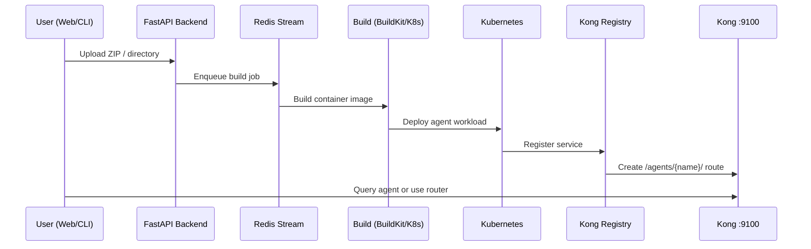

# Agent Deployment Flow

End-to-end path from upload to a routable agent behind Kong.

## Sequence



## Agent package requirements

Every deployable agent needs at minimum:

- `AgentCard.json` — capabilities, examples, endpoints (routing input)
- `Dockerfile`
- `pyproject.toml`
- `src/main.py` — FastAPI entry with `/health`

See [[reference/sample-agents]] and `README.md#-agent-development`.

## Status lifecycle (UI)

| Status | Meaning |
|--------|---------|
| Setting Up | Upload received; image build in progress |
| Active | Running; reachable via Kong |
| Failed | Build or deploy error — check logs |

Typical local time: **1–2 minutes** after upload.

## Code touchpoints

| Step | Location |
|------|----------|
| Upload API | `app/service/agent_upload_service.py` |
| Upload tracking | `app/service/agent_upload_tracking_service.py` |
| K8s build worker | `worker/k8s_build_worker.py` |
| Docker helpers | `orchestrator/docker_utils.py` |
| Registry | `orchestrator/registry_manager.py` |

## CLI equivalents

```bash
nasiko agent upload-directory ./agents/a2a-translator --name translator
nasiko agent upload-zip agents/a2a-translator.zip --name translator
nasiko agent list
```

## Related

- [[architecture/query-routing]]
- [[reference/local-development]]
- [[reference/troubleshooting#agent-stuck-in-setting-up-or-failed]]

## Log

- 2026-05-16 — Flow documented from README data-flow section
