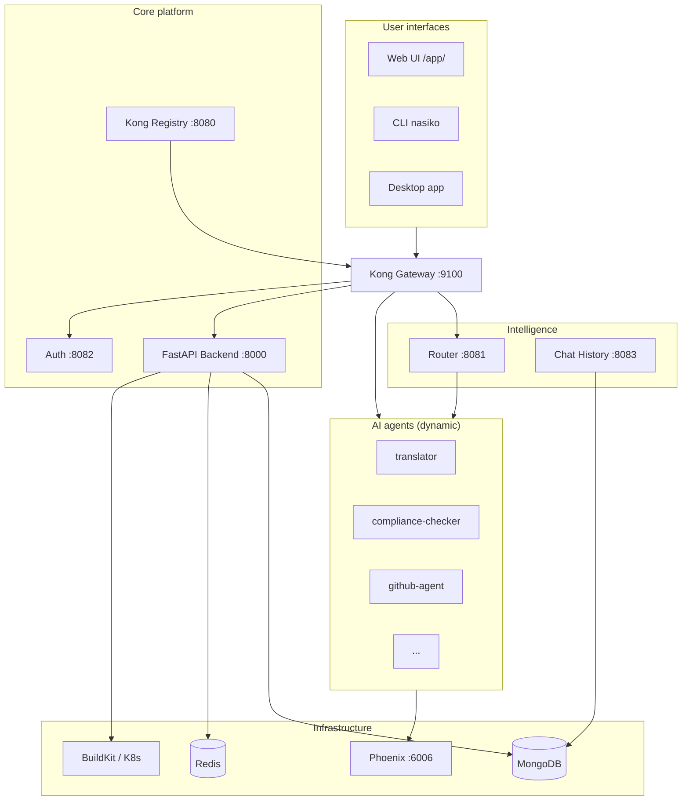

# Nasiko Platform Overview

Nasiko is an **AI agent developer control plane**: registry, deployment, intelligent routing, auth, and observability for containerized agents behind Kong.

## System diagram

## Component responsibilities

| Component | Path | Responsibility |
|-----------|------|----------------|
| FastAPI backend | `app/` | Agent registry, upload, K8s orchestration, GitHub OAuth, build pipeline |
| Agent gateway | `agent-gateway/` | Kong, router, chat-history, plugins |
| CLI | `cli/` | Deploy, agents, K8s bootstrap, GitHub helpers |
| Orchestrator | `orchestrator/` | Superuser init, Docker/registry helpers |
| Worker | `worker/` | K8s build worker |
| Sample agents | `agents/` | A2A reference implementations |

## Data flows (summary)

| Flow | Path | Detail |
|------|------|--------|
| Deploy agent | CLI/Web → API → Redis → build → registry → K8s → Kong | [[architecture/agent-deployment-flow]] |
| Route query | User → Kong → Router → LangChain → agent | [[architecture/query-routing]] |
| Observe | Agent → Phoenix SDK → UI + Phoenix UI | [[reference/local-development#observability]] |

## Key entrypoints in code

- API routes: `app/api/routes/`
- Router: `agent-gateway/router/src/main.py`
- Agent registry: `agent-gateway/router/src/core/agent_registry.py`
- Upload service: `app/service/agent_upload_service.py`
- Local compose: `docker-compose.local.yml`

## Related

- [[architecture/services-and-ports]]
- [[reference/sample-agents]]
- [[index]]

## Log

- 2026-05-16 — Expanded with mermaid diagram and code pointers
