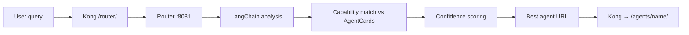

# Query Routing

The router service selects the best agent for a natural-language query using **LangChain** analysis and **AgentCard.json** metadata.

## Flow



## Steps

1. **Query analysis** — intent and requirements from user text
2. **Capability matching** — compare against each agent's `capabilities`, `tags`, `examples` in AgentCard
3. **Confidence scoring** — rank candidates
4. **Selection** — return agent URL + score; fallback if no strong match

## Example

```bash
curl "http://localhost:9100/router/route?query=translate this to French"
```

Expected shape: agent URL under `/agents/translator/` with confidence score.

## LLM provider for router

Configured via env (see [[reference/environment-variables]]):

| Provider | `ROUTER_LLM_PROVIDER` | API key var |
|----------|----------------------|-------------|
| OpenAI (default) | `openai` | `OPENAI_API_KEY` |
| OpenRouter | `openrouter` | `OPENROUTER_API_KEY` |
| MiniMax | `minimax` | `MINIMAX_API_KEY` |

Also set `ROUTER_LLM_MODEL` (e.g. `gpt-4o-mini`, `MiniMax-M2.7`).

## Code touchpoints

- Router entry: `agent-gateway/router/src/main.py`
- Agent registry / cards: `agent-gateway/router/src/core/agent_registry.py`
- Settings: `agent-gateway/router/src/config/settings.py`

## Related

- [[reference/sample-agents]] — example AgentCards
- [[architecture/overview]]

## Log

- 2026-05-16 — Router flow documented from README
