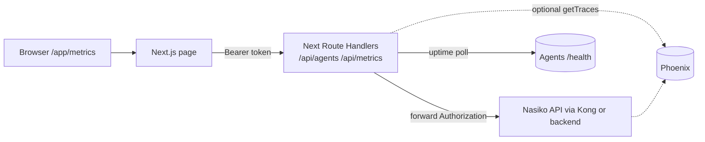

# Plan — Challenge 2: Agent Performance Metrics Page

> **Implementation status:** B1–B7 + **Phase C UI** shipped in `web/metrics-dashboard/` (dev port **3003**). Live dev guide: [[../reference/metrics-dashboard-dev]].

## Summary

Ship a per-agent performance page for the 24h Titan Builder Challenge: four KPI cards (avg latency, success, errors, uptime %) and a 24h latency chart. **Next.js App Router** serves the UI at `/app/metrics/`; **Next Route Handlers** (server) call the **Nasiko API** with the user's Bearer token and optionally **@arizeai/phoenix-client** for trace reads. No new FastAPI metrics router required for the happy path.

## Research basis

Research: [[../research/challenge-2-agent-metrics-page]] · status: **done** (Phase A spike merged 2026-05-16)

Carry-ins:

- Phoenix traces via Nasiko `/api/v1/observability/*` and/or Phoenix REST from Next server
- Kong `GET /agents/{name}/health` for uptime; uptime % = successful / expected polls over 24h
- Main shell is Flutter-only in fork → sibling **Next.js** app
- Aggregation runs on the **Next server** (Route Handlers), not in the browser

## Decision

**Architecture (updated 2026-05-16):**

| Layer | Choice |
|-------|--------|
| UI | **Next.js 15** (App Router) at `web/metrics-dashboard/`, dev **:3003**, Kong `/app/metrics/` (compose TBD) |
| Data API | **Next Route Handlers** — `app/api/agents/route.ts`, `app/api/metrics/route.ts` |
| Platform/auth/agents | **Nasiko API** — forward `Authorization: Bearer` from client |
| Trace reads | **Primary:** Nasiko `GET /api/v1/observability/agent/{id}/stats` · **Optional:** `@arizeai/phoenix-client` `getTraces()` if stats insufficient for success/error or hourly series |
| Charts | **Recharts** |
| FastAPI `GET /metrics/agents` | **Out of scope** (optional fallback only — see Rollback) |

**UI (Phase A):** No editable Flutter source — prebuilt `nasiko-web` image only.

**Phoenix naming:** registry `agent_id` → Phoenix project name (`GET /v1/projects/{agent_id}`).

**Auth:** Browser reads `access_token` from `localStorage` `nasiko-credentials-*` JSON → sends `Authorization` to Next routes → Next forwards to Nasiko.

**Server env (Next):**

```env
NASIKO_API_URL=http://localhost:9100          # host dev (via Kong)
# NASIKO_API_URL=http://nasiko-backend:8000   # optional direct backend in compose
PHOENIX_URL=http://phoenix-observability:6006 # optional, server-only
```

## Scope

### In scope

- Next.js metrics page at `/app/metrics/` (Kong → metrics container)
- Route Handler `GET /api/agents` → Nasiko `GET /api/v1/registry/user/agents`
- Route Handler `GET /api/metrics?agent=&window=24h` → Nasiko observability + health rollup → dashboard JSON
- Agent selector, four KPI cards, Recharts 24h line chart
- Loading / error / no-data states
- `scripts/synthetic_load.py` for demo traffic
- Vitest (or similar) for rollup helper unit tests

### Out of scope (non-goals)

- New `app/api/routes/metrics_routes.py` on FastAPI (unless fallback triggered)
- Browser → Phoenix direct (no CORS / no keys in client)
- Full SRE dashboard, multi-env, windows other than 24h

## Architecture / approach



**Flow:**

1. User logs in on Flutter `/app/` → token in `localStorage`.
2. User opens `/app/metrics/` → Next page loads.
3. Client `fetch("/api/agents", { headers: { Authorization } })` → Next proxies to Nasiko registry.
4. Client `fetch("/api/metrics?agent=a2a-translator", { headers: { Authorization } })` → Next calls Nasiko observability stats (+ optional Phoenix client), polls health, returns KPIs + `series_24h`.

## API contracts (implemented + planned)

### `GET /api/agents` (B3 — done)

Request: `Authorization: Bearer <token>`

Response:

```json
{
  "agents": [
    {
      "agentId": "a2a-translator",
      "name": "Translator Agent",
      "description": "...",
      "tags": ["translation", "..."]
    }
  ],
  "statusCode": 200,
  "message": "Retrieved N accessible agents for authenticated user"
}
```

Upstream: `GET /api/v1/registry/user/agents`. Empty `agents[]` = user has no deployed/permissioned agents yet.

### `GET /api/health` (B2 — done)

No auth. Returns `{ ok, nasikoApiUrl, gateway, backend }`.

### `GET /api/metrics` (B4 done; B5–B6 enrich)

Query: `agent` = registry **agentId** (e.g. `a2a-translator`), `window=24h`.

Response:

```json
{
  "agent": "a2a-translator",
  "avg_latency_ms": 1210,
  "success": 142,
  "error": 3,
  "uptime_pct": 99.2,
  "series_24h": [
    { "ts": "2026-05-16T10:00:00Z", "latency_ms": 1100, "success": 12, "error": 0 }
  ]
}
```

24 buckets, oldest→newest; missing hours `null`. Uptime formula in PR + `docs/metrics-page.md`.

## Affected code

| Path | Change |
|------|--------|
| `web/metrics-dashboard/` | **new** — Next.js 14+ App Router project |
| `web/metrics-dashboard/app/page.tsx` | **new** — metrics dashboard UI |
| `web/metrics-dashboard/app/api/agents/route.ts` | **new** — proxy to Nasiko registry |
| `web/metrics-dashboard/app/api/metrics/route.ts` | **done** — Nasiko stats → KPIs; B5 rollup for series |
| `web/metrics-dashboard/lib/metrics.ts` | **done** — window parse, stats → dashboard mapper |
| `web/metrics-dashboard/lib/nasiko.ts` | **new** — `nasikoFetch`, auth header helper |
| `web/metrics-dashboard/lib/rollup.ts` | **new** — KPI + hourly bucket logic (testable) |
| `web/metrics-dashboard/lib/auth.ts` | **done** — Bearer forwarding |
| `web/metrics-dashboard/lib/types.ts` | **done** — Nasiko + UI agent types |
| `web/metrics-dashboard/app/api/health/route.ts` | **done** |
| `web/metrics-dashboard/app/api/agents/route.ts` | **done** |
| `web/metrics-dashboard/.env.example` | **done** — `NASIKO_API_URL`, `PHOENIX_URL` |
| `web/metrics-dashboard/package.json` | **new** — `next`, `react`, `recharts`, `@arizeai/phoenix-client` (optional) |
| `docker-compose.local.yml` + Kong registry | edit — service + route `/app/metrics/` |
| `scripts/synthetic_load.py` | **new** — demo traffic |
| `web/metrics-dashboard/**/*.test.ts` | **new** — rollup unit tests |
| `docs/metrics-page.md` | **new** — usage, uptime formula, architecture |

**Not in happy path:** `app/api/routes/metrics_routes.py`, `metrics_handler.py`, `health_poller.py` on FastAPI.

## Task breakdown

Total budget: **24h**. S = ≤30m, M = ≤1h, L = ≤2h.

### Phase A — Spike / Discovery (H0–2) — DONE

- [x] **A1–A5** — See [[../sessions/2026-05-16-challenge-2-agent-metrics-page]] and Log below.

### Phase B — Next API layer (H2–6, total 4h)

Goal: Route Handlers return real dashboard JSON using Nasiko API (server-side).

- [x] **B1** (M, ~45m) Scaffold Next.js app at `web/metrics-dashboard/` (App Router, TypeScript)
      ✓ `npm run dev` serves placeholder; build passes
      ↳ blocked by: A5
- [x] **B2** (S, ~20m) Add `lib/nasiko.ts` + `.env.example` (`NASIKO_API_URL`)
      ✓ `nasikoFetch(path, authorization)` hits Nasiko health or registry in dev
      ↳ blocked by: B1
- [x] **B3** (M, ~30m) Implement `GET app/api/agents/route.ts` → `/api/v1/registry/user/agents`
      ✓ Returns agent list when called with valid Bearer (401 without)
      ↳ blocked by: B2
- [x] **B4** (M, ~1h) Implement `GET app/api/metrics/route.ts` — call Nasiko `/api/v1/observability/agent/{id}/stats?start_time=`
      ✓ Returns dashboard JSON with `avg_latency_ms` from `latency_ms_p50`, `success` from `trace_count`
      ↳ blocked by: B2, A3
- [x] **B5** (M, ~1h) Add `lib/rollup.ts` — success/error from sessions, 24 hourly buckets via `/observability/session/list`
      ✓ `npm run test` — `lib/rollup.test.ts`
      ↳ blocked by: B4
- [x] **B6** (M, ~45m) Uptime: `lib/uptime.ts` polls Kong `/agents/agent-{agentId}/`; in-memory buffer; `uptime_pct` + `source.uptime` meta
      ↳ blocked by: B4
- [x] **B7** (S, ~20m) `scripts/smoke-api.sh` + `npm run smoke` (needs `NASIKO_BEARER_TOKEN`)
      ↳ blocked by: B3, B5, B6

### Phase C — Next UI (H6–12, total 6h)

Goal: demo-able page; browser only calls Next `/api/*`, never Nasiko or Phoenix directly.

- [x] **C1** (M, ~1h) Metrics page layout at `/` (dev `:3003`; Kong `/app/metrics/` TBD)
      ↳ blocked by: B1
- [x] **C2** (M, ~45m) Agent selector — `fetch("/api/agents")` with Bearer (localStorage + dev token paste on :3003)
      ↳ blocked by: C1, B3
- [x] **C3** (M, ~1h) KPI cards — four cards from `/api/metrics`
      ↳ blocked by: C2, B7
- [x] **C4** (L, ~1.5h) Recharts line chart from `series_24h`
      ↳ blocked by: C2, B7
- [x] **C5** (M, ~45m) Loading, error, no-data, auth states
      ↳ blocked by: C3, C4
- [x] **C6** (S, ~30m) Dark theme tokens in `globals.css` + `metrics-dashboard.css`
      ↳ blocked by: C5

### Phase D — Polish (H12–16, total 4h)

Unchanged intent; dependencies on Phase C.

- [ ] **D1** Refresh + last updated
- [ ] **D2** Chart tooltips with units
- [ ] **D3** A11y pass
- [ ] **D4** Empty-state copy
- [ ] **D5** PR screenshots (4 states)
- [ ] **D6** `docs/metrics-page.md` — document Next→Nasiko architecture + uptime formula

### Phase E — Demo prep (H16–20)

- [ ] **E1–E5** — Sample agents, synthetic load, error window, video, dry-run (blocked by **B7**, not old B6)

### Phase F — Submission (H20–24)

- [ ] **F1–F5** — Fork, PR, Devpost (unchanged)

## Acceptance criteria

1. [x] New page reachable — dev http://localhost:3003; Kong `/app/metrics/` — Phase D
2. [x] Per-agent avg latency, success, error, uptime % — UI + `/api/metrics`
3. [x] Chart covering last 24h — Recharts `series_24h`
4. [ ] Uptime formula documented in `docs/metrics-page.md` — Phase D
5. [x] **`GET /api/metrics`** returns documented JSON shape
6. [x] **Rollup unit test** passes (`lib/rollup.test.ts`)
7. Demo video ≤60s — Phase E
8. PR to `Nasiko-Labs/nasiko` main with screenshots — Phase F

## Risks & mitigations

| Risk | Mitigation | Trigger |
|------|------------|---------|
| R1 — No UI source | Next sibling app (closed in Phase A) | — |
| R2 — Stats API insufficient for success/error series | Add `@arizeai/phoenix-client` in Route Handler only | B5 incomplete at H6 |
| R3 — Flat charts | `synthetic_load.py` | E2 |
| R4 — Next can't reach Nasiko in Docker | `NASIKO_API_URL` per network; use Kong host alias | B7 fails in compose |
| R5 — Token not sent to Next routes | Document login-then-metrics flow; helper in `lib/auth.ts` | C2 401 loop |
| R6 — Judges want single backend | PR explains: Nasiko = platform; Next = hackathon UI layer | — |

## Open questions

- [x] UI — Next.js at `web/metrics-dashboard/`
- [x] Data path — Next Route Handlers → Nasiko API (server)
- [ ] Judges OK with `/app/metrics/` sibling route
- [x] Deploy translator → registry `agentId` **`a2a-translator`** verified ([[../reference/metrics-dashboard-dev]])
- [x] Phoenix project `a2a-translator` confirmed after agent traffic
- [x] `getTraces()` not needed — session list rollup (B5)

## Rollback / fallback

- Challenge 1 pivot: unchanged (ADR 0002).
- If Next cannot reach Nasiko in Docker by H6: implement minimal `GET /api/v1/metrics/agents` on FastAPI and point Next `NASIKO_API_URL` at it (revert to original B-phase design).
- If Phoenix unreachable from Next container: Nasiko observability stats only; empty series with clear copy.

## Related

- [[../research/challenge-2-agent-metrics-page]]
- [[../decisions/0002-hackathon-pick-challenge-2]]
- [[../features/challenge-2-agent-metrics-page]]
- [[../sessions/2026-05-16-challenge-2-agent-metrics-page]]
- [[../architecture/overview]]
- [[../reference/metrics-dashboard-dev]]

## Log

- 2026-05-16 — **Phase C done:** `MetricsDashboard` UI — selector, KPIs, Recharts, auth/dev token
- 2026-05-16 — **B5–B7 done:** rollup + uptime + vitest + `scripts/smoke-api.sh`
- 2026-05-16 — **B4 done:** `GET /api/metrics` → Nasiko observability stats; `lib/metrics.ts` mapper
- 2026-05-16 — Vault docs: [[../reference/metrics-dashboard-dev]]; plan API contracts updated for B1–B3
- 2026-05-16 — **B3 verified (user):** token + deployed translator → `agentId: a2a-translator`; dev port **3003**
- 2026-05-16 — **B3 done:** `GET /api/agents` → Nasiko registry; 401 without/invalid Bearer verified
- 2026-05-16 — **B2 done:** `lib/nasiko.ts`, `lib/auth.ts`, `GET /api/health` smoke test → Nasiko OK
- 2026-05-16 — **B1 done:** `web/metrics-dashboard/` scaffolded (Next 15, App Router, `npm run build` OK)
- 2026-05-16 — **Plan revised:** aggregation + Nasiko/Phoenix calls move to **Next Route Handlers** (`/api/agents`, `/api/metrics`); FastAPI metrics router removed from happy path; Phase B/C tasks rewritten; acceptance criteria updated.
- 2026-05-16 — Phase A re-executed and complete.
- 2026-05-16 — Plan drafted; 6 phases / 24h budget
