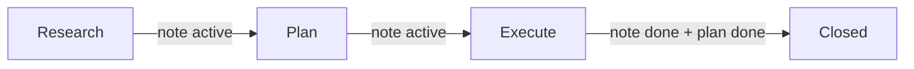

# Phased Development Workflow

How Cursor agents work on non-trivial features in this repo. Enforced by the Cursor rule `phased-development` (alwaysApply).

## Phases

| Phase | Cursor rule | Persists to | Status to clear gate |
|-------|-------------|-------------|----------------------|
| Research | `phase-research` | `vault/research/<slug>.md` | `active` |
| Plan | `phase-plan` | `vault/plans/<slug>.md` | `active` |
| Execute | `phase-execute` | `vault/sessions/<YYYY-MM-DD>-<slug>.md` | `done` |

`<slug>` is the kebab-case feature slug; reuse the slug across all three notes.

## Trigger

Non-trivial = touches multiple files/services, new endpoint/page/table/dependency, unclear requirements, or the user says "build / implement / design / research / plan / ship".

Trivial fixes (typo, one-line bug, formatting) skip the workflow.

## Hard rules

- Don't start Plan before Research is `active`
- Don't write code before Plan is `active`
- Append-only timeline in execution notes
- One ADR per hard-to-reverse decision; link from the plan and the session
- Update the plan's task checklist as execution progresses (don't delete)

## Templates

- [[../templates/research]]
- [[../templates/plan]]
- [[../templates/execution]]

## Indexes

- [[../research/_index]]
- [[../plans/_index]]
- [[../sessions/README]]
- [[../features/_index]]

## How a Cursor session typically flows

1. User: "let's build X"
2. Agent reads `vault/index.md`, recognizes non-trivial work, opens Research phase
3. Agent drafts `vault/research/<slug>.md` from `vault/templates/research.md`, fills sections, sets `status: active`, asks user to confirm
4. On confirm, Agent opens Plan phase, drafts `vault/plans/<slug>.md`, fills sections, sets `status: active`, asks user to confirm
5. On confirm, Agent enters Execute phase, opens a session note, edits code, ticks acceptance criteria, logs timeline, closes session as `done` and marks the plan `done`

## Cursor rule files

- `.cursor/rules/phased-development.mdc` — orchestrator, `alwaysApply: true`
- `.cursor/rules/phase-research.mdc` — agent-requested
- `.cursor/rules/phase-plan.mdc` — agent-requested
- `.cursor/rules/phase-execute.mdc` — agent-requested

See [[cursor-rules-how-to]] for the rule-writing conventions these were authored against.

## Related

- [[cursor-rules-how-to]]
- [[../decisions/_index]]
- [[../features/_index]]
- [[../index]]

## Log

- 2026-05-16 — Workflow defined and Cursor rules authored
